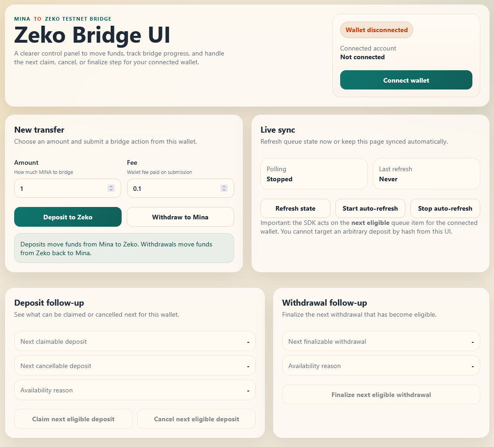
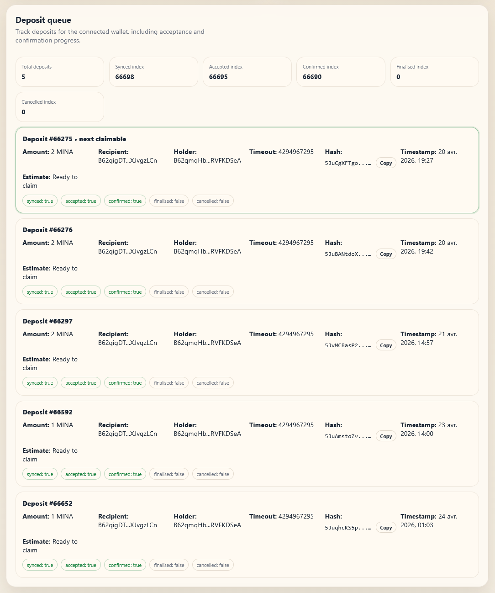
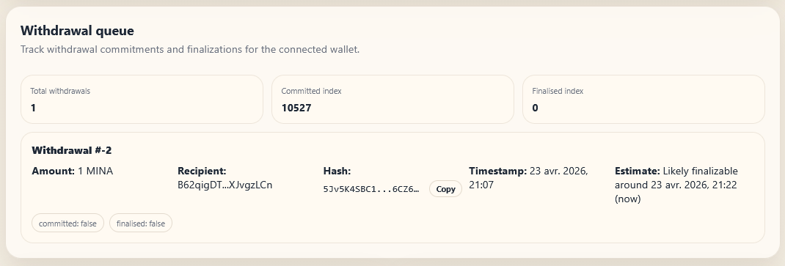

# Zeko Bridge UI

A small browser UI for testing the Zeko bridge flow from a connected Mina wallet.

It lets you:

- connect a wallet
- submit deposits
- submit withdrawals
- monitor deposit and withdrawal queues
- finalize or cancel eligible bridge actions
- view readable timestamps and estimated next-step timing
- switch networks automatically when an action requires a different chain

## Screenshots

### Main dashboard



### Deposit queue



### Withdrawal queue



## Features

- Wallet connection through an injected Mina-compatible provider such as Auro
- Deposit and withdrawal submission from the browser
- Queue views for deposits and withdrawals tied to the connected wallet
- Local history of submitted actions
- Hash copy buttons for queue entries
- Readable timestamps instead of raw chain values
- Estimated timing for withdrawals and deposits
- Automatic network switching before sending transactions
- Deposit timestamp fallback logic when the SDK state response is incomplete
- Duplicate withdrawal cleanup when the SDK returns the same action twice

## Networks

This UI is currently configured for:

- L1: Mina devnet APIs
- L2: Zeko testnet APIs

Action routing:

- Deposit submit: Mina devnet
- Withdrawal submit: Zeko testnet
- Deposit finalize: Zeko testnet
- Deposit cancel: Mina devnet
- Withdrawal finalize: Mina devnet

## Requirements

- Node.js 18+ recommended
- A Mina-compatible browser wallet
- Access to the configured Mina and Zeko testnet endpoints

## Install

```bash
npm install
```

## Run Locally

Start the dev server:

```bash
npm run dev
```

Build for production:

```bash
npm run build
```

Preview the production build locally:

```bash
npm run preview
```

## Project Structure

```text
src/
  bridge.js   Bridge SDK wiring and state adapters
  wallet.js   Wallet provider helpers and network switching
  main.js     UI rendering and user actions
  style.css   App styles
docs/
  index.html  Built site output
```

## How It Works

1. The app initializes the Zeko bridge SDK with the configured L1, L2, archive, and actions API endpoints.
2. The wallet is connected through `window.mina`.
3. Queue state is fetched for the connected wallet.
4. The UI polls regularly to refresh deposit and withdrawal progress.
5. Before sending a transaction, the app checks the required network and asks the wallet to switch when needed.

## Queue Notes

### Withdrawals

- The UI shows committed and finalized status.
- Finalization timing is estimated from the bridge withdrawal delay.
- Duplicate rows are deduplicated before rendering.

### Deposits

- The UI shows synced, accepted, confirmed, finalized, and canceled states.
- Timing hints describe the next likely step, such as acceptance or claim readiness.
- If the normal SDK deposit state is missing a timestamp, the app falls back to bridge diagnostics to recover it.

## Known Limitations

- ETA values are best-effort estimates, not guarantees.
- Automatic network switching depends on wallet support for the provider methods.
- Some wallets may expose network IDs differently, so compatibility can vary.
- The production bundle is currently quite large and Vite warns about chunk size during build.

## Future Improvements

- Add explicit network status in the header
- Add countdown timers that update live without a refresh
- Add filtering for queue states
- Add better empty and error states
- Add screenshot assets and polished documentation examples

## License

This project is licensed under the GNU General Public License v3.0.

See [LICENSE](./LICENSE) for the full text.
